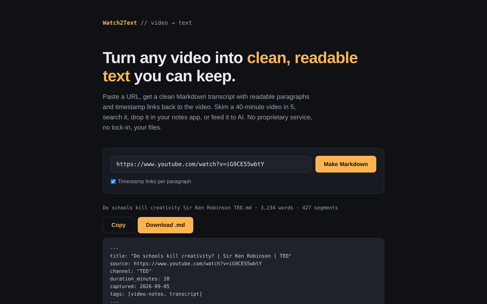

# Watch2Text

Turn any YouTube video, or any web article, into clean, readable Markdown: real paragraphs, YAML frontmatter, and (for video) timestamp links back to the exact moment. Built for note-takers, researchers, and anyone feeding content to AI tools. Runs on your machine.

**Live:** https://www.watch2text.com (the hosted version is in private beta, see [Why the hosted version is gated](#why-the-hosted-version-is-gated))



## What it does

Paste a URL. Get back a `.md` file that looks like this:

```markdown
---
title: "Do schools kill creativity? | Sir Ken Robinson | TED"
source: https://www.youtube.com/watch?v=iG9CE55wbtY
channel: "TED"
duration_minutes: 20
captured: 2026-09-05
tags: [video-notes, transcript]
---

# Do schools kill creativity? | Sir Ken Robinson | TED

[0:27](https://www.youtube.com/watch?v=iG9CE55wbtY&t=27s) Good morning. How are you? It's been great, hasn't it? I've been blown away by the whole thing...
```

Every paragraph carries a link to the second it starts, so the document doubles as an index into the video.

## Why this exists

Video is a terrible reference format. You can't skim it, search it, or paste it into your notes. Captions already contain the text, but raw captions arrive as unpunctuated fragments full of `[Music]` cues, duplicated lines, and HTML entities. The cleaning pipeline is the actual product; the transcription part is the easy 20%.

## How it works

Three lanes, picked automatically from the URL:

- **Captions (free, instant):** most YouTube videos have captions, creator-uploaded or auto-generated. We fetch them and run the cleaning pipeline. Zero marginal cost.
- **Whisper (your own key):** no captions? [yt-dlp](https://github.com/yt-dlp/yt-dlp) downloads the smallest audio track and OpenAI's `whisper-1` transcribes it with timestamps, then the same cleaner runs. About $0.006 per minute of audio, billed to your key, never through us.
- **Articles:** any other web address goes through Readability (main content only, no nav or ads) and Turndown (HTML to Markdown), with the same frontmatter shape.

### The cleaning pipeline (`lib/markdown.ts`)

1. Strip bracketed cues (`[Music]`, `[Applause]`) and decode HTML entities
2. De-duplicate overlapping fragments (auto-captions repeat themselves constantly)
3. Rebuild paragraphs using the timing gaps between caption segments, with a soft length cap so nothing becomes a wall of text
4. Emit YAML frontmatter, a header block, and one timestamp link per paragraph
5. Produce a filename that survives Obsidian, Windows, and macOS

Tested against a batch of real videos: a 20-minute talk (427 caption segments) comes out as ~3,200 words in 24 paragraphs with zero leftover artifacts.

### Fetching captions (`lib/transcript.ts`)

Uses [youtubei.js](https://github.com/LuanRT/YouTube.js) with two deliberate choices, both learned the hard way:

- `getBasicInfo` with the **ANDROID client**, because the full watch-page parser is brittle against markup changes and the WEB client returns `UNPLAYABLE` from datacenter IPs
- The caption URL's `fmt` parameter must be **replaced** with `json3` (via `URL.searchParams.set`), not appended, or you get XML back

## Why the hosted version is gated (videos only)

YouTube serves empty responses to requests from datacenter IP ranges (Vercel, AWS, and also free proxy providers, which are datacenter IPs too). Your home connection is fine; a server is not. The app detects this (`blocked` flag) and shows an honest "private beta" message instead of a misleading "no captions" error.

The fix is a residential proxy (`PROXY_URL`), which costs money. Rather than spend ahead of demand, the hosted site collects a waitlist. **Running locally, everything works with no proxy at all.** The proxy layer (`lib/proxyFetch.ts`) has an 8-second fail-fast timeout with fallback to direct fetch, so a dead proxy can never hang a request.

## Use it as a command (recommended)

The fastest way to use Watch2Text is from the terminal: no server, no browser, the file lands straight in your notes folder.

```bash
git clone https://github.com/JohnCalafiore/watch2text.git
cd watch2text
npm install          # also builds the CLI
npm link             # makes `watch2text` available everywhere

watch2text --set-out ~/Notes/Videos            # remember your notes folder, once
watch2text https://www.youtube.com/watch?v=iG9CE55wbtY
# wrote ~/Notes/Videos/Do schools kill creativity Sir Ken Robinson TED.md  (3,234 words)
```

More:

```bash
watch2text <url> <url> <url>            # several at once, videos and articles mixed
watch2text https://paulgraham.com/greatwork.html   # any article
watch2text --file urls.txt              # one URL per line
watch2text --out ./somewhere <url>      # one-off folder
watch2text --no-timestamps <url>        # plain paragraphs
watch2text --stdout <url> | pbcopy      # straight to the clipboard (macOS)
```

Output folder resolution: `--out`, then `$WATCH2TEXT_DIR`, then `~/.watch2textrc`, then the current directory. Because it runs on your machine, no proxy is needed.

### Videos without captions (Whisper)

One-time setup:

```bash
winget install yt-dlp        # Windows   (macOS: brew install yt-dlp, or: pip install yt-dlp)
watch2text --set-key sk-...  # your OpenAI API key, stored in ~/.watch2textrc readable only by you
```

After that, caption-less videos are transcribed automatically; the output line says `whisper` instead of `manual` or `auto`. Current limit is OpenAI's 25 MB upload, roughly 60 to 90 minutes of audio at the low bitrate we request. `$OPENAI_API_KEY` in the environment works too.

### Prefer a window to a terminal?

Double-click **`Start Watch2Text.cmd`** in the project folder. It builds the app the first time (about a minute), then opens the web version at `http://localhost:3005`. Make a desktop shortcut to it. For Whisper in the web version, copy `.env.local.example` to `.env.local` and add your key.

## Run the web app locally

```bash
npm install
npm run dev
# open http://localhost:3000
```

Batch quality check across many videos (writes each `.md` to `test-output/` and prints an artifact report):

```bash
npx tsx scripts/batch-test.ts urls.txt      # one URL per line
```

## Stack

Next.js 15 (App Router), TypeScript, youtubei.js, undici (proxy dispatcher), @mozilla/readability + linkedom + turndown (article lane), yt-dlp + OpenAI whisper-1 (Whisper lane), Supabase (waitlist storage via insert-only RLS), esbuild (CLI bundle). Deployed on Vercel.

## Roadmap

- [x] `watch2text <url>` CLI that writes straight into a notes folder (npm publish pending)
- [x] Article-to-Markdown lane (same output format, web pages instead of video)
- [x] Whisper lane for caption-less videos, BYO key (via yt-dlp)
- [ ] Long-video chunking past OpenAI's 25 MB limit
- [ ] Playlists and batch export
- [ ] Residential proxy for the hosted version, once the waitlist justifies it

## License

MIT
